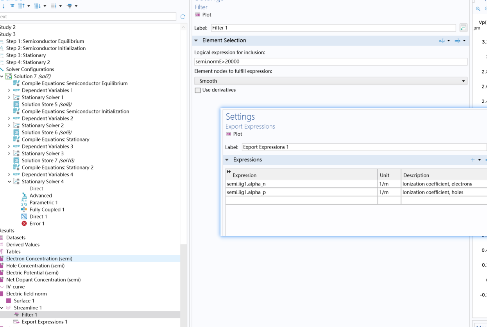
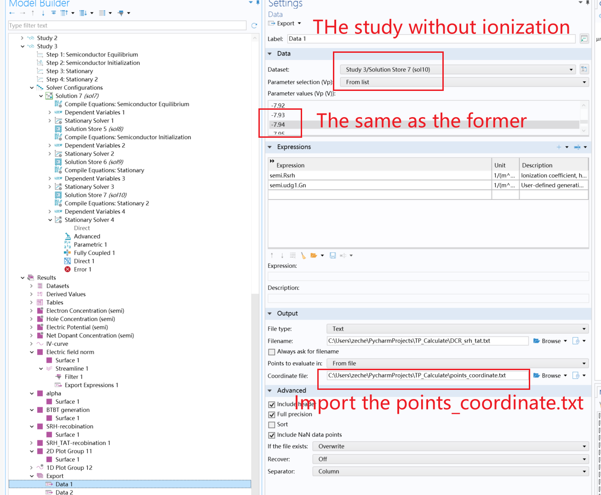
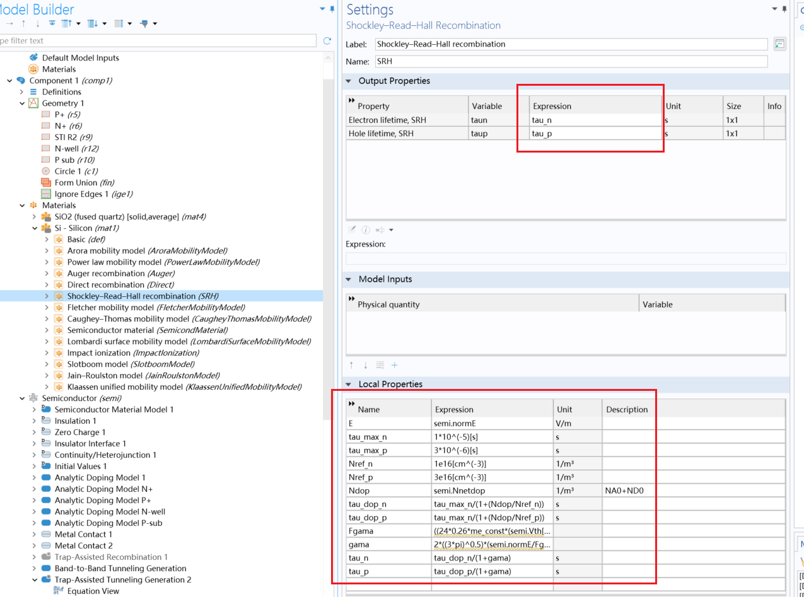
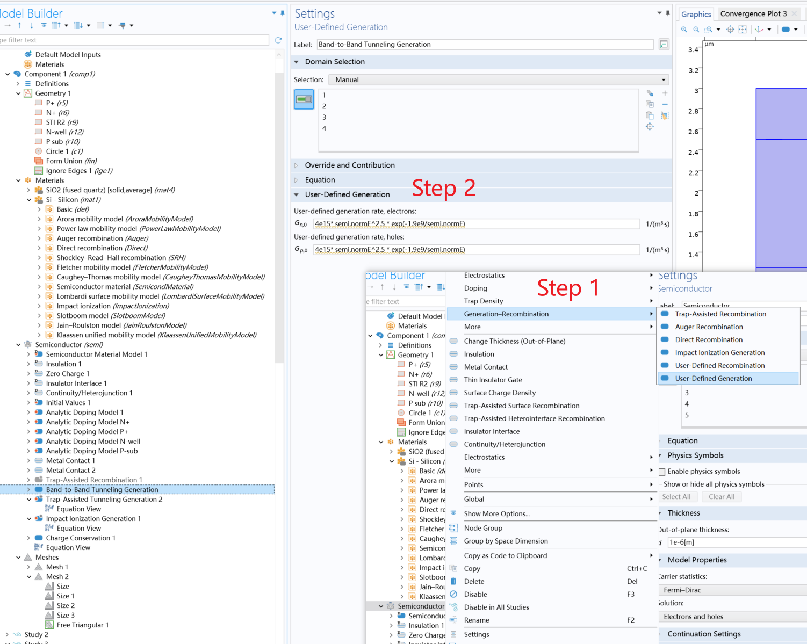

# My Project
## A. Calculate the DCR parameters of SPAD using python with Comsol simulated data.
## 1. export Ionization coefficient, electrons / holes  
###   (1) create streamlines under "Electric field form" 2D-plot  
####    a. add streamline
  
####    b. add filter under streamline(adjust the figure to get the fitting streamlines)  
####    c. add Export Expressions(choose alpha_n and anlha_p)

 ###  (2) export alpha_n & alpha_p

## 2. export SRH generation term & BTBT generation term  
###   (1) get the points coordinate of the streamlines from step1  
Import [alpha.txt](data_files%2Falpha.txt) correctly   
Run [Get_points_coordinate.py](Get_points_coordinate.py), then you will get [points_coordinate.txt](data_files%2Fpoints_coordinate.txt).  
     
###    (2) export SRH & BTBT    

## 3. Calculate the DCR parameters 
Import [alpha.txt](data_files%2Falpha.txt) and [DCR_srh_tat.txt](data_files%2FDCR_srh_tat.txt) correctly.  
Run [DCR_calculate.py](DCR_calculate.py)

  
  
  
# B. Import SRH_TAT model and BTBT model to Comsol
## Reference：
1. https://ieeexplore.ieee.org/document/8999742
2. https://ieeexplore.ieee.org/document/121690
## 1. SRH_TAT model
Copy the expression to comsol from [Comsol_configure.txt](data_files%2FComsol_configure.txt), which will modify  the original SRH model
in comsol to the SRH_TAT model.

## 2. BTBT model
Creat a User-Defined Generation model and modefy the generation rate, which you can find in [Comsol_configure.txt](data_files%2FComsol_configure.txt).

